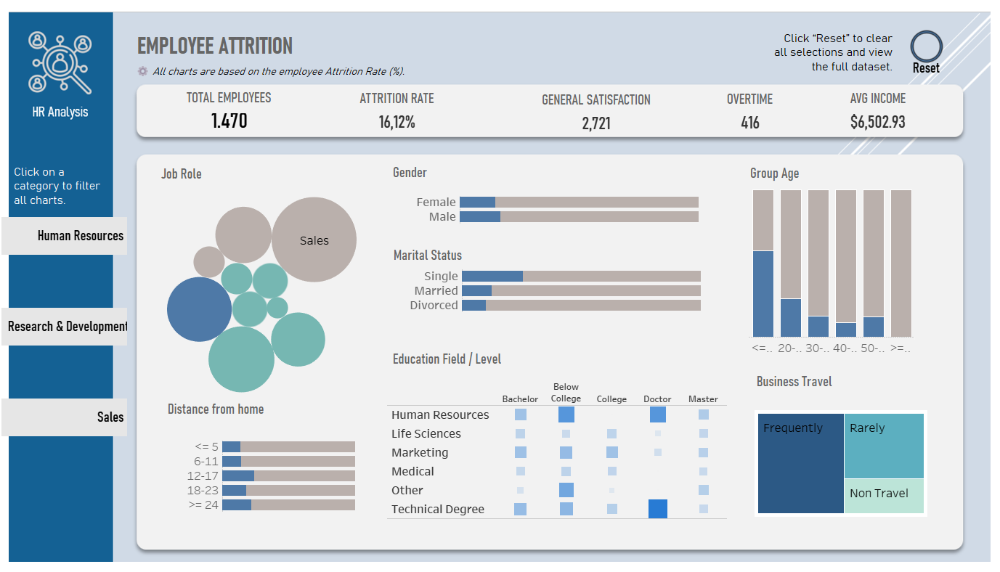

###Analisis de Rotación de Empleados

El objetivo del análisis es identificar los factores clave que influyen en la rotación de empleados y generar recomendaciones basadas en datos que ayuden al área de Recursos Humanos a diseñar estrategias efectivas de retención.

Preguntas clave del análisis: ¿Cuál es la tasa general de rotación en la organización? ¿Qué departamentos y roles presentan mayor rotación? ¿Cómo se relacionan la edad, la educación y la distancia al trabajo con la rotación? ¿Qué patrones se observan según género, estado civil y frecuencia de viajes?

Proceso de análisis
1.	Validación y limpieza de datos
2.	Análisis exploratorio
3.	Modelado Predictivo

Conclusiones
•	Las variables JobRole, OverTime y MaritalStatus mostraron mayor influencia en la tasa de abandono.
•	Los empleados con menor satisfacción y estabilidad laboral presentan una mayor probabilidad de rotación.
•	Las correlaciones entre variables numéricas son bajas, lo que sugiere independencia entre factores, aunque se observaron asociaciones notables con horas extra, rol laboral y estado civil.
•	Factores como StockOptionLevel, pertenecer a I+D y la satisfacción laboral favorecen la permanencia de los empleados en la compañía.
•	El modelo ensamblado (Logistic Regression + Gradient Boosting) alcanzó un mejor balance entre sensibilidad y exactitud en comparación con los modelos individuales y se presenta como una herramienta efectiva para priorizar estrategias de retención

Recomendaciones
•	Fortalecer planes de desarrollo profesional en roles de ventas y administrativos.
•	Reducir las horas extra y promover el equilibrio vida-trabajo.
•	Implementar encuestas de satisfacción periódicas para anticipar el riesgo de abandono.

Vista previa del dashboard

Explora el dashboard interactivo en Tableau Public:
[Employee Attrition Dashboard](https://public.tableau.com/app/profile/katherine.parra5686/viz/HR_Analysis_17628044953940/Dashboard2)

